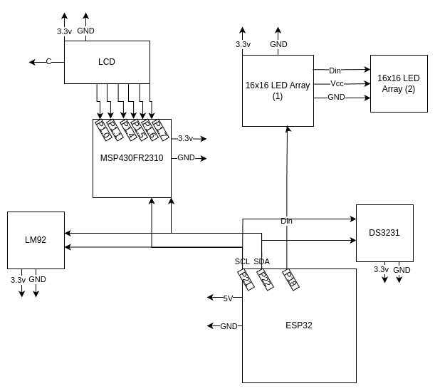

# EELE 465 Final Project
*ESP32 LED Array Control via Wireless Web App Interface*

**From Proposal:**

"The idea I had was to create and operate a cheap chainable led array from amazon that is controlled by an MSP430FR2310, but the user can control from their phone (utilizing a raspberry pi hotspot which also hosts a server for array control). After getting recommended to the ESP32 from you [Trevor Vannoy] I switched away from the thought of using a raspberry pi; this will be helpful for both power and space. The goal is to make it a mobile setup; then possibly put it on my cap for graduation. For the sake of having values to display, either over LED array or LCD, I’ll also hook up a temperature sensor and real-time-clock. Hopefully I can lean into my Computer Science background with the ESP32 while maintaining a footing within the realm of Microcontroller Applications."

### Prescalar requirements 

**Inputs:**
* Temperature Sensor
* RTC
* Wireless Web Interface
  * Buttons
  * Text Input Form

**Outputs:**
* LCD
* 16x16 LED array(s)
* Heartbeat LED
  * External for MSP430FR2310
  * Internal for ESP32
------------------------------------
**Master (ESP32):**
* Hosting a hotspot and web interface for input
* Managing the slave output over I2C and reading from slaves
* Controlling/Updating LED Array

**Slaves (MSP430FR2310, DS3231, LM92):**
* LCD (MSP430FR2310)
* RTC (DS3231)
* Temperature (LM92)

# Final Project Circuit Design
*Altered slightly from proposal, but still maintains I2C master/slave topology*

# Final Project Flowchart
*Note concurrent processes of the main loop and Led Array Control (LAC) loop!*

## Difficulties in implementation of initial design
*Mostly discussion of why the secondary MSP430FR2310 was ommitted from the original design.*

Initially the plan was to use another MSP430 to control the LED array, sending modes and values over I2C from the primary controller (ESP32), but the issue arose with just how difficult it would be to properly implement an LED array protocol along with all other aspects of the project. So, instead I made up my mind to use an ISP32 along with libraries included for Arduino to control the LED array. This would have also been formatted as a slave over I2C; however, I then learned the ESP32 has a really amazing feature considering the price of it was about ~$3.66! 

As you may have noticed, there's a lot going on within the ESP32! But... how is it all being managed without significant delays on the LED array -- especially in consideration of I2C delay concerns? Well it all comes down to the ESP32 having... *pause for effect*... **two processing cores**! That right! This sucker can do multithreaded tasks! So I created a task to run separatly of the main loop in which to update the LED array based on editable character arrays -- of course managed using malloc() and free() for the sake of safe memory usage. Technically speaking this device acutally has three tasks running, two concurrently at a time, which are: the main loop, the LED array loop, and the wifi hostspot. 

This also, to some limited degree, made control over the LED array much easier; at least after pulling my hair out over issues with memory safety and the ESP32 Kernal panics due to accessing memory outside of the heap! (<- which probably took signigicantly longer than just using I2C... you can debate how much easier this route actually was...) 

[Backup Demo Youtube Link](https://youtu.be/YtcjxF9x2d8)
