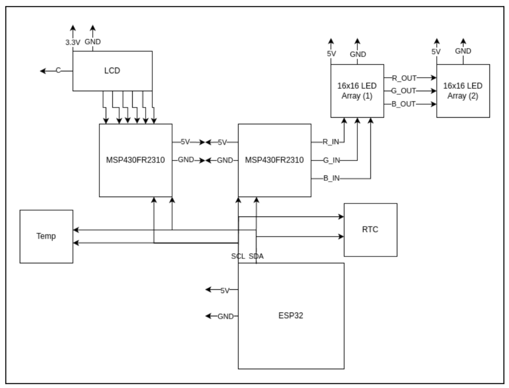

# Final project proposal

- [X] I have reviewed the project guidelines.
- [X] I will be working alone on this project.
- [X] No significant portion of this project will be (or has been) used in other course work.

## Embedded System Description

Graduation Cap LED-Array & Control

&nbsp;&nbsp;&nbsp;&nbsp;&nbsp;&nbsp;
The idea I had was to create and operate a cheap chainable led array from amazon that is controlled by an
MSP430FR2310, but the user can control from their phone (utilizing a raspberry pi hotspot which also hosts a server
for array control). After getting recommended to the ESP32 from you I switched away from the thought of using a
raspberry pi; this will be helpful for both power and space. The goal is to make it a mobile setup; then possibly put it
on my cap for graduation. For the sake of having values to display, either over LED array or LCD, I’ll also hook up
a temperature sensor and real-time-clock. Hopefully I can lean into my Computer Science background with the
ESP32 while maintaining a footing within the realm of Microcontroller Applications.

## Hardware Setup

&nbsp;&nbsp;&nbsp;&nbsp;&nbsp;&nbsp;
Although fairly similar from a high level, this project is vastly different from most other labs we’ve done
this semester. One portion is the layout, really the only constant is the LCD slave. Differences start minor with the
substitution of the Temperature sensor for I2C interface, and they end with using the ESP32 for driving I2C
peripherals. We also include 1-2 chainable 16x16 LED arrays driven by a separate MSP430FR2310 over I2C.

## Software overview

&nbsp;&nbsp;&nbsp;&nbsp;&nbsp;&nbsp;
The user will be able to connect to a hotspot hosted by the ESP32, open a browser, and control the system
outputs via a web app hosted by the ESP32 on its own network. The outputs will be options for pretty patterns,
letters, numbers, or readings from the temperature sensor and real-time-clock. Another cool option to tack on, since I
ordered a pack of 3 ESP32s, would be to create another input to the system with another ESP32 as a remote control
to change pre-programmed patterns on the original ESP’s output peripherals. Though, it should be noted the last one
may not be implemented based on time restraints.

## Testing Procedure

**Web Interface**
* connect to ESP32 hotspot
* navigate to web app

**LED Array**
* Display pattern(s)
* Display character(s)
* Display time and temp

**LCD**
* Display selected pattern (custom for characters)
* Display time and temp

***Optional:* ESP32 wireless remote**
* Button 1: pattern 1
* Button 2: pattern 2
* Button 3: pattern 3
* On/Off for outputs

## Prescaler

Desired Prescaler level: 

- N%>83%

### Prescalar requirements 

**Inputs:**
* Temperature Sensor
* RTC
* Wireless Web Interface

**Outputs:**
* LCD
* 16x16 LED array(s)
* Heartbeat LED
------------------------------------
**Master (ESP32):**
* Hosting a hotspot and web interface for input
* Managing the slave output over I2C

**Slaves (MSP430FR2310):**
* Controlling LCD
* Controlling 16x16 LED array(s)

### Argument for Desired Prescaler

&nbsp;&nbsp;&nbsp;&nbsp;&nbsp;&nbsp;
I would argue that there is a large amount of learning required to complete this project, especially
considering the use of a new microcontroller that does not use the same programming software (in theory that
should easily be setup, but I have been wrong in that regard before). Furthermore, most portions of the project are
very new to me, and thus I can’t for certain say how difficult it truly will be. What I can say is that it will be
interesting and provide me useful skills with another popular microcontroller.
